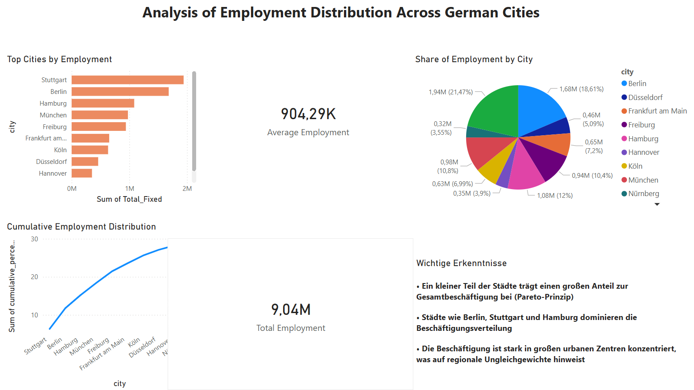

# 📊 Analyse der Beschäftigungsverteilung in deutschen Städten

## 📌 Projektübersicht

Dieses Projekt analysiert die Beschäftigungsverteilung in deutschen Großstädten anhand offizieller Daten (Destatis).
Ziel ist es, Muster der Beschäftigungskonzentration zu identifizieren und regionale Unterschiede sichtbar zu machen.

Der Fokus liegt auf der Kombination von **Datenaufbereitung (SQL & Python)** und **Business-Visualisierung (Power BI)**.

---

## 🛠️ Technologien

* **SQL** – Datenbereinigung und Aggregation
* **Python (Pandas)** – Datenverarbeitung und Analyse
* **Power BI** – Dashboard und Visualisierung

---

## 📂 Datensatz

Quelle: **Deutsche Beschäftigungsstatistik (Destatis)**

Enthaltene Variablen:

* Stadt
* Gesamtbeschäftigung
* Jahr

---

## 🔍 Analyse

Die Analyse umfasst:

* Ranking der Städte nach Gesamtbeschäftigung
* Anteil jeder Stadt an der Gesamtbeschäftigung
* Kumulative Verteilung (**Pareto-Analyse**)
* Durchschnittliche Beschäftigung pro Stadt

---

## 📈 Dashboard



👉 Das Dashboard zeigt:

* Top-Städte nach Beschäftigung
* Prozentuale Verteilung
* Pareto-Kurve zur Identifikation der wichtigsten Städte

---

## 📊 Key Insights

* Die Beschäftigung ist **stark konzentriert**:
  Ein kleiner Teil der Städte trägt einen großen Anteil zur Gesamtbeschäftigung bei (Pareto-Prinzip)

* **Top 3 Städte (Berlin, Stuttgart, Hamburg)** machen etwa **~50 % der Gesamtbeschäftigung** aus

* Es bestehen deutliche **regionale Ungleichgewichte**, da Beschäftigung stark in urbanen Zentren gebündelt ist

---

## 🚀 Ausführung

1. SQL-Skripte zur Datenaufbereitung ausführen
2. Daten mit Python verarbeiten:

```bash
python analysis.py
```

3. Power BI Dashboard öffnen:

```text
dashboard.pbix
```

---

## 👩‍💻 Autorin

**Romina Emadi**
Data Science Studentin | Ziel: Data Analyst

---

## 📜 License

MIT License
